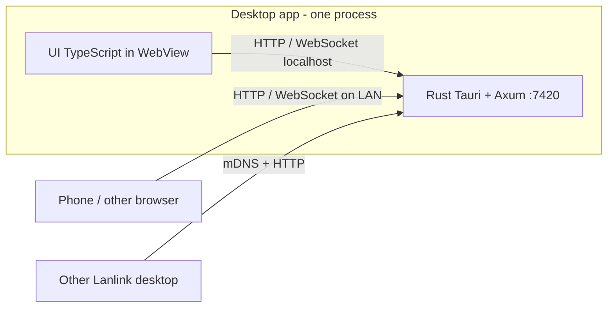

# Lanlink

Send a file or a short note to another device on the same Wi‑Fi. Install the desktop app on a computer; phones and extra machines just open a page in the browser. No account, no cloud.

Stay on a network you trust. Nothing is encrypted, so don’t put this on the public internet. Details are in [SECURITY.md](SECURITY.md).

## Features

- Send files between computers, or from a computer to a phone browser (and back)
- Recipient taps **Accept** before any file data moves
- Pick several nearby devices and send the same file to each
- Shared notes board: paste a line, everyone sees it, copy or open links
- QR code and join URL so a phone doesn’t need an app
- Desktops find each other on the LAN automatically
- Themes, light/dark, transfer history
- Programs and scripts are blocked; Windows warns if the network is marked Public

## Run it

You need [Rust](https://rustup.rs), [Node.js](https://nodejs.org) 18+, and [Tauri 2’s extras](https://v2.tauri.app/start/prerequisites/) (WebView2 on Windows, webkitgtk on Linux). On Windows, install [Visual Studio 2022 Build Tools](https://visualstudio.microsoft.com/visual-cpp-build-tools/) with **Desktop development with C++**. If `cargo` says `link.exe` is missing, run that installer by hand.

```bash
npm install
npm run desktop
```

That builds the UI, starts the LAN server on port **7420**, and opens the window.

Windows shortcut after the C++ tools are in:

```powershell
powershell -ExecutionPolicy Bypass -File scripts\dev.ps1
```

Debian/Ubuntu extras:

```bash
sudo apt install libwebkit2gtk-4.1-dev build-essential curl wget file libxdo-dev libssl-dev libayatana-appindicator3-dev librsvg2-dev
```

If devices don’t see each other, allow **TCP 7420** and **UDP 5353** on a private/home firewall profile. Don’t forward those ports on the router.

## How it works

1. The desktop app shows up on the LAN and listens on port 7420.
2. Nearby computers appear in the device list. A phone joins by scanning the QR code or opening the address.
3. You pick a file and one or more devices. Each recipient gets Accept / Decline. Accepted files land in `Downloads/Lanlink` on a computer, or as a download in the browser.
4. Shared notes skip Accept: paste, send, and the line shows up on every connected device.

## Where Rust sits

The window you click around in is TypeScript. The LAN work is Rust: Tauri opens the window, then an Axum server on port 7420 handles files, notes, and who is nearby. The UI just talks to that server.

A phone never runs Rust. It loads the same page from the computer. Transfers still go through that machine.



The left box is one installed app. The window uses `127.0.0.1`. Phones and other computers use the LAN address.

| Piece | Language | What it does |
|---|---|---|
| `ui/` | TypeScript | Screen: send, notes, themes, history |
| `src-tauri/src/lib.rs` | Rust | Starts the window and the server |
| `src-tauri/src/server.rs` | Rust | HTTP and WebSocket API |
| `src-tauri/src/transfer.rs` | Rust | Moves file bytes after Accept |
| `src-tauri/src/discovery.rs` | Rust | Finds other desktops on the LAN |
| `src-tauri/src/state.rs` | Rust | Peers, offers, notes, save folder |

## License

MIT
